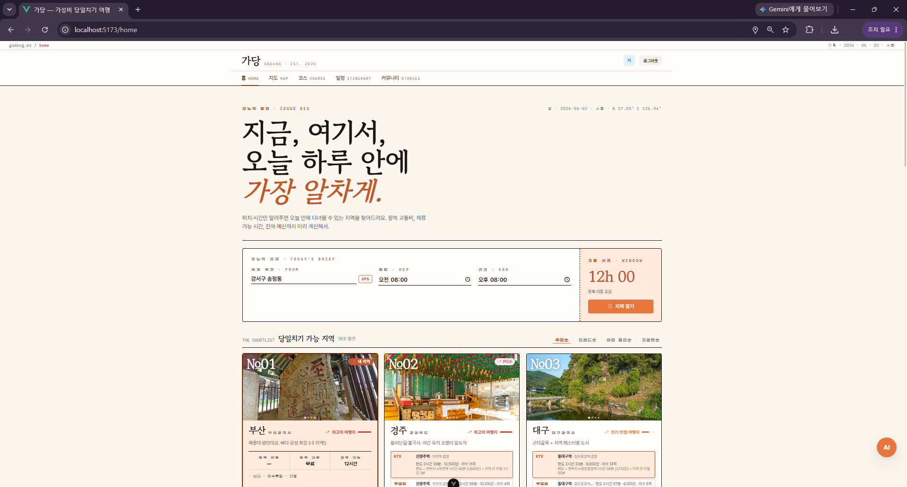
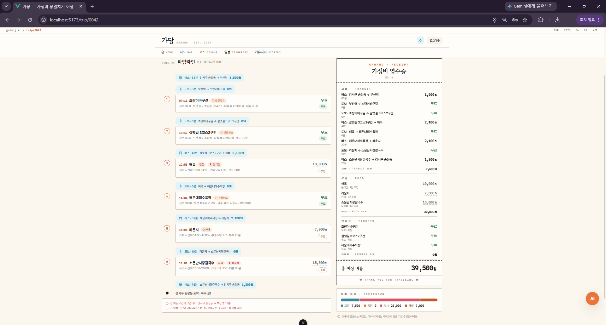
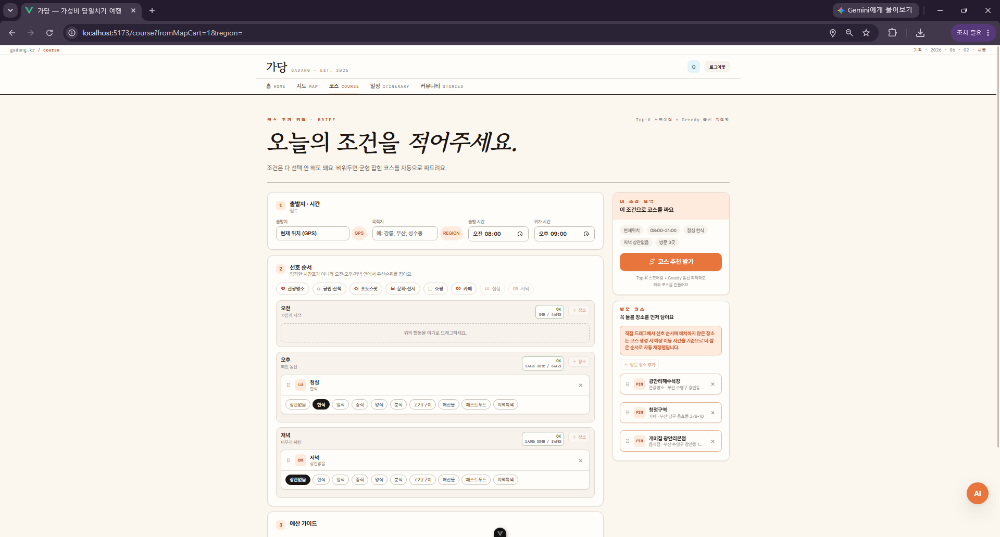
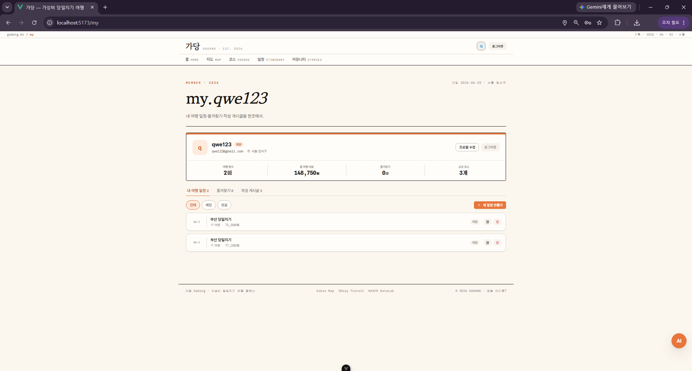
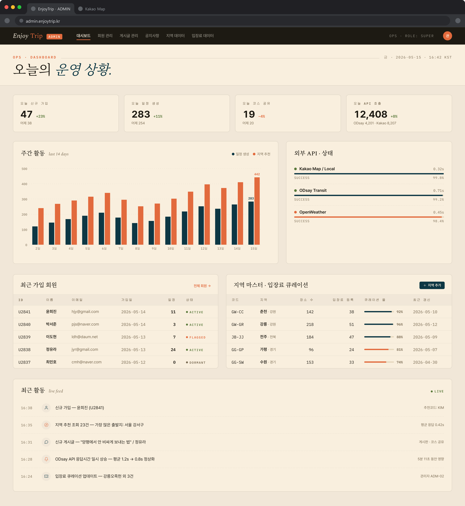

# 가당 (GaDang) — 가성비 당일치기 여행 플래너

> 현재 위치와 여행 조건을 입력하면 당일치기로 다녀올 지역과 장소를 추천하고,
> 이동 시간과 예상 비용을 반영한 하루 코스를 만들어 주는 여행 서비스입니다.

팀 프로젝트 · 2026.05 ~ 2026.06

| 홈 — 추천 지역 탐색 | 지도 — 장소 탐색 | 일정 — 여행 코스 |
|---|---|---|
|  |  |  |

| 코스 — 조건 입력 | 커뮤니티 — 코스 공유 | 마이페이지 — 여행 기록 |
|---|---|---|
|  |  |  |

---

## 주요 기능

- 출발 위치와 가용 시간을 기준으로 당일치기 가능 지역 추천
- 관광지·맛집·카페 검색과 카테고리별 지도 탐색
- 선호 장소, 체류 시간, 예산을 반영한 여행 코스 생성
- 교통비·입장료·식비를 합산한 예상 비용 제공
- 일정 저장, 즐겨찾기, 커뮤니티 공유와 댓글
- 네이버·카카오 소셜 로그인 및 관리자 운영 기능
- 여행 후기 코퍼스를 활용한 AI 여행 도우미

## 아키텍처

```text
[ Vue 3 + Vite / Nginx ]
           │ REST API · JWT
           ▼
[ Spring Boot + MyBatis ] ──────► [ FastAPI RAG ]
           │                         │
           ▼                         └─ GMS Embedding API
       [ MySQL 8 ]
           │
           └─ Kakao · Naver · ODsay · TourAPI · 공공데이터포털
```

Docker Compose가 프론트엔드, 백엔드, AI 서버, 데이터베이스를 하나의 네트워크에서 실행합니다.

---

## 담당 기능 — 회원·커뮤니티·관리자

| Phase | ID | 기능 | 난이도 |
|---|---|---|---|
| 1 | F107 | 회원 CRUD | ⭐ |
| 1 | F108 | 로그인·JWT | ⭐ |
| 1 | F109 | 공지사항 | ⭐ |
| 1 | F110 | 코스 공유 게시판 + 댓글 | ⭐⭐ |
| 1 | F118 | 즐겨찾기 | ⭐⭐ |
| 1 | F133 | 마이페이지 | ⭐ |
| 2 | F134 | 관리자 — 회원 관리 | ⭐⭐ |
| 2 | F135 | 관리자 — 공지사항 관리 | ⭐⭐ |
| 2 | F136 | 관리자 — 운영 데이터 관리 | ⭐⭐ |

## 핵심 엔지니어링

### 1. 인증과 인가 — 토큰 발급보다 중요한 요청 단위 권한 검증

회원가입 시 비밀번호를 BCrypt로 해시하고, 로그인 성공 시 사용자 ID·이메일·역할을 담은 서명 JWT를 발급합니다. 서버 세션은 만들지 않으며 `OncePerRequestFilter`가 모든 요청의 Bearer 토큰을 검증합니다.

토큰의 서명만 신뢰하지 않고 매 요청마다 사용자 ID를 DB에서 다시 조회합니다. 탈퇴한 사용자나 존재하지 않는 사용자라면 아직 만료되지 않은 토큰도 `401`로 차단합니다. 인증이 끝난 요청은 Spring Security의 역할 기반 규칙으로 분기해 `/api/admin/**` 전체를 `ADMIN`에게만 허용하고, 인증 실패와 권한 부족을 각각 `401`과 `403` JSON 응답으로 구분했습니다.

```text
Authorization: Bearer JWT
        │
        ▼
서명·만료 검증 → 사용자 DB 재조회 → SecurityContext 등록
        │
        ├─ 일반 보호 API: 로그인 사용자
        └─ /api/admin/**: ROLE_ADMIN만 허용
```

### 2. 커뮤니티 데이터 무결성 — 인증과 리소스 소유권을 분리 검증

로그인했다는 사실만으로 다른 사용자의 데이터를 수정할 수 없도록 서비스 계층에서 리소스 소유권을 별도로 확인합니다.

- 코스 공유 시 `trip_id + user_id`를 함께 조회해 본인의 여행 일정만 게시 가능
- 게시글·댓글 수정/삭제 전 작성자 ID와 현재 사용자 ID 비교
- 관리자는 작성자가 아니어도 댓글 삭제와 게시글 블라인드 처리 가능
- 공개 목록에서는 블라인드 게시글을 제외하고 관리자 목록에서만 전체 조회
- 게시글 삭제 시 장소 상세·댓글이 함께 정리되도록 외래키의 `ON DELETE CASCADE` 적용

즐겨찾기는 장소 존재 여부와 중복 여부를 서비스에서 먼저 검증하고, DB에도 `(user_id, place_id)` 복합 UNIQUE 제약을 두어 동시 요청에서도 중복 행 생성을 막았습니다.

### 3. 마이페이지 — 기능별 데이터를 하나의 사용자 관점으로 조합

마이페이지는 별도 거대 쿼리를 만들지 않고 회원, 여행, 게시글, 즐겨찾기 서비스를 조합합니다. 요약 API는 사용자 정보와 여행 수·누적 비용·게시글 수·즐겨찾기 수를 한 응답으로 제공하고, 상세 목록은 공통 `PageResponse` 형식으로 분리했습니다.

페이지 번호는 최소 1, 페이지 크기는 최대 50으로 보정해 과도한 조회를 막고 다음 형식을 모든 목록 API에서 공유합니다.

```text
items + page + size + totalCount
```

### 4. 관리자 운영 — 단순 CRUD에서 운영 데이터 정제까지



관리자는 회원 검색·역할 변경·삭제, 공지 관리, 입장료와 프랜차이즈 블랙리스트 관리, 전체 운영 현황 집계를 수행할 수 있습니다. 역할 변경 값은 `USER`와 `ADMIN`으로 제한하고, 입장료 유형도 `FREE`, `FIXED`, `ESTIMATED`만 허용해 잘못된 운영 데이터 유입을 서비스 계층에서 차단합니다.

장소별 비용·체류시간 통계는 여행 일정과 커뮤니티 후기의 표본을 합친 뒤 다음 순서로 정제합니다.

```text
일정·후기 표본 통합 → 장소별 그룹화 → 범위 필터 → 양끝 이상치 제거 → 평균·최솟값·최댓값
```

`trimPercent`를 0~40%로 제한하고 최소 표본 수를 적용해 소수의 극단값이 운영 기준을 왜곡하는 문제를 완화했습니다.

### 5. 외부 API 조회 — Caffeine L1 + MySQL L2 캐시

장소 후보 조회는 외부 API 호출 결과를 Caffeine 메모리 캐시에서 먼저 찾고, miss일 때 MySQL의 `REGION_PLACES`를 조회합니다. 서버가 재시작되어 L1이 사라져도 L2에 저장된 후보를 복원할 수 있으며, L2에도 없을 때만 Kakao·Naver 조회를 수행하고 결과를 다시 저장합니다.

연속된 GPS 좌표가 매번 다른 캐시 키를 만들지 않도록 위도·경도를 `0.05°` 격자로 양자화했습니다. 카테고리 목록은 정렬한 뒤 키에 포함해 입력 순서가 달라도 같은 요청으로 취급하며, 장소 후보의 L2 freshness window는 7일입니다.

```text
요청 좌표·카테고리
      │ 0.05° 격자 키 생성
      ▼
L1 Caffeine → L2 MySQL(REGION_PLACES, 7일) → Kakao·Naver → L2 저장
```

동일한 L1/L2 패턴을 DataLab 트렌드, 지역 이미지, 기차·버스 시간표에도 적용했습니다. 현재 L2 저장소는 Redis가 아니라 MySQL입니다.

### 6. 외부 API 쿼터 방어와 인기 스코어링

교통 데이터는 사용자 요청에서 조회된 결과를 DB에 write-through하고, 매일 04:00 배치가 미등록·만료 데이터를 제한된 예산 안에서 갱신합니다.

| 대상 | 배치 예산 | 캐시 freshness | 처리 방식 |
|---|---:|---:|---|
| 코레일 | 200쌍/일 | 20시간 | 미등록 노선 우선, 남은 예산으로 오래된 노선 갱신 |
| ODsay 버스 | 80쌍/일 | 6일 | 기존 노선 중 만료된 노선만 갱신 |

미운행 노선은 시간·요금·운행 횟수를 `-1`로 저장하는 부정 캐싱으로 같은 실패 조회의 반복을 줄였습니다. Naver 블로그 조회는 3개 고정 스레드 풀로 동시성을 제한하고, 429 응답에는 지수 백오프를 적용한 뒤 재시도가 소진되면 해당 코스 생성에서 추가 검색을 중단합니다.

장소 인기도는 Naver 블로그 언급량을 사용하며 10,000건 미만 후보를 제외하고 카테고리 가중치로 편중을 보정합니다. 지역 트렌드는 Naver DataLab의 상대값을 사용하되 모든 배치에 서울을 앵커로 포함해 서로 다른 배치의 점수 기준을 통일하고, 결과를 MySQL에 24시간 보관합니다.

### 7. 코스 자동 생성 — 시간 제약을 지키는 구간별 Greedy

사용자가 고정한 장소는 anchor로 취급합니다. 방문 시간이 있는 anchor를 시간순으로 정렬하고 하루를 구간으로 나눈 뒤, 각 구간 안에서 후보 장소를 Greedy 방식으로 선택합니다.

```text
후보 점수 = 인기도 − 현재 위치와의 거리 × 0.7 − 다음 목적지와의 거리 × 0.3
```

후보를 추가할 때마다 다음 anchor 도착 가능 여부와 최종 귀가 시간 예산을 다시 검사합니다. 식사·카페는 필수 시간 슬롯으로 관리하고, anchor와 같은 장소가 일반 후보로 중복 삽입되지 않도록 이름과 좌표를 함께 비교합니다. 테스트에서는 anchor 도착 시간 유지, 여러 anchor의 순서, anchor 이전 Greedy 삽입, 최대 장소 수 제약을 검증합니다.

### 8. 서비스 단위 테스트 결과

2026-07-13, OpenJDK 17에서 회원·커뮤니티·즐겨찾기 서비스의 Mockito 단위 테스트를 재실행했습니다. 아래 결과는 기능 분기 검증이며 API 응답시간이나 부하 성능 측정값이 아닙니다.

| 테스트 영역 | 검증 내용 | 테스트 | 실패 |
|---|---|---:|---:|
| 회원·인증 | 정상 로그인, 이메일 중복 차단, 기본 USER 가입 | 3 | 0 |
| 커뮤니티 | 타인 글 수정 차단, 타인 일정 공유 차단, 관리자 댓글 삭제 | 3 | 0 |
| 즐겨찾기 | 없는 장소 차단, 중복 즐겨찾기 차단 | 2 | 0 |
| **합계** |  | **8** | **0** |

```bash
cd Backend
./mvnw -Dtest=AuthServiceTest,CommunityServiceTest,FavoriteServiceTest test
```

Docker Compose 스모크 테스트에서도 Vue `200`, 공지 API `200`, FastAPI health `ok`, MySQL health `healthy`를 확인했습니다.

### 개선 포인트

| 우선순위 | 현재 한계 | 개선 방향 | 검증 기준 |
|---|---|---|---|
| P0 | 24시간 access token을 `localStorage`에 저장해 XSS 노출 시 만료 전 회수가 어려움 | access token 15~30분 + refresh token HttpOnly/Secure 쿠키 + rotation·서버 저장 | 탈취 access token 만료, refresh 재사용 탐지, 로그아웃 즉시 폐기 |
| P1 | 동일 캐시 키의 동시 miss가 외부 API 호출로 함께 진행될 수 있음 | `@Cacheable(sync=true)` 또는 분산 락으로 cache stampede 방어 | 콜드 동시 요청에서 외부 수집 1회 보장 |
| P1 | 배치 예산은 제한하지만 사용자 요청과 합산한 일일 쿼터는 추적하지 않음 | 저장소 기반 전역 일일 카운터와 소진 시 graceful degradation 적용 | 배치·온디맨드 합산 호출이 일일 상한을 넘지 않음 |
| P1 | 커뮤니티 목록이 댓글 전체를 JOIN·GROUP BY한 뒤 OFFSET/LIMIT 적용 | 게시글 ID를 먼저 페이지네이션한 뒤 선택된 글만 댓글 집계, `(is_blinded, created_at, post_id)` 인덱스와 keyset pagination 적용 | 10만/100만 건에서 p95 및 읽은 행 수 비교 |
| P1 | 장소 운영 통계가 전체 표본을 애플리케이션 메모리로 가져와 그룹화 | SQL 집계 또는 배치 materialized summary 테이블로 이전 | 표본 증가에 따른 heap 사용량과 응답시간 비교 |
| P1 | 서비스 단위 테스트는 보유하지만 Security Filter·MySQL 제약의 통합 검증이 부족 | Testcontainers 기반 인증/권한/중복 요청 통합 테스트 추가 | 401·403·UNIQUE 충돌·CASCADE 삭제 자동 검증 |
| P2 | 관리자 변경 이력과 민감 작업 감사 로그가 없음 | actor, 대상, 변경 전후 값, 시각을 저장하는 audit log 도입 | 역할 변경·삭제·블라인드 작업의 추적 가능성 확인 |

## 기술 스택

| 영역 | 기술 |
|---|---|
| Frontend | Vue 3, Vite, Pinia, Vue Router, Axios, Nginx |
| Backend | Java 17, Spring Boot, Spring Security, MyBatis, Caffeine |
| AI | FastAPI, Uvicorn, NumPy, GMS OpenAI-compatible API |
| Database | MySQL 8 |
| External API | Kakao Local/Map, Naver, ODsay, TourAPI, 공공데이터포털 |
| Runtime | Docker, Docker Compose |

---

## Docker로 실행

### 1. 환경 변수 준비

```bash
cp .env.example .env
```

`.env`에서 데이터베이스 비밀번호와 `JWT_SECRET`을 변경하고, 사용할 외부 API 키를 입력합니다.
지도 표시는 `KAKAO_JAVASCRIPT_KEY`, AI 기능은 `GMS_KEY`가 필요합니다.

### 2. 전체 서비스 시작

```bash
docker compose up -d --build
```

| 서비스 | 주소 |
|---|---|
| Web | http://localhost:5173 |
| Backend API | http://localhost:8080/api |
| AI health check | http://localhost:8000/health |
| MySQL | 컨테이너 내부 전용 |

실행 상태와 로그는 다음 명령으로 확인할 수 있습니다.

```bash
docker compose ps
docker compose logs -f
```

서비스를 종료하려면 다음 명령을 사용합니다.

```bash
docker compose down
```

데이터베이스 볼륨까지 초기화하려면 `docker compose down -v`를 실행합니다.

---

## 프로젝트 구조

```text
.
├─ Backend/       Spring Boot API
├─ frontend/      Vue 웹 애플리케이션
├─ ai-server/     FastAPI 기반 RAG 검색 서버
├─ docs/          기획·설계·발표 문서
├─ images/        README 및 프로젝트 화면 이미지
└─ compose.yaml   전체 서비스 실행 구성
```

## 문서

- [프로젝트 상세 명세](docs/PROJECT_SPEC.md)
- [추천 알고리즘 설계](docs/ALGORITHM.md)
- [로컬 개발 환경 설정](docs/SETUP.md)
- [협업 문서](docs/협업.md)
- [개발 기록](docs/devlog/2026-06-25.md)
- [발표 자료](docs/가당_발표자료.pptx)
- [프로젝트 산출물](docs/가당_프로젝트_산출물.docx)
